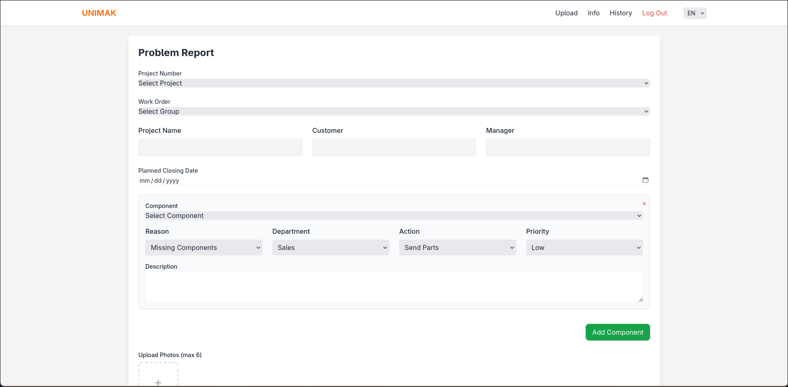

```markdown
# Problem Reporting & Tracking System

This repository contains the internal **Problem Reporting & Tracking Website** developed for [Company Name].  
The system is built with **Flask (Python)**, **SQLite**, **Jinja2 templates**, and **TailwindCSS** for styling.  

It allows project managers, engineers, and other stakeholders to **log, track, and resolve problems** in an organized and transparent way.

---
### Video Demo:  <https://youtu.be/FzHdTrJX1_Q>
---

## 🚀 Features

- **Problem Management**
  - Create and manage problem records linked to projects, customers, and managers.
  - Attach related components, actions, and responsible departments.
  - Track status, priority, planned closure date, and approval details.

- **File & Media Uploads**
  - Upload and display related photos for each problem.
  - Organize uploads by project/problem ID in structured folders.

- **Dynamic Views**
  - Expandable/collapsible problem detail cards.
  - Interactive table view with filtering and column selection.

- **Admin Panel**
  - View all problems in a dashboard.
  - Inspect related components and photos in detail.

---

## 🛠️ Tech Stack

- **Backend**: Flask (Python)
- **Database**: SQLite
- **Frontend**: HTML, Jinja2, TailwindCSS
- **Other**: JavaScript for interactivity

---


## ⚡ Installation & Setup

1. **Clone the repository**
   ```bash
   git clone https://github.com/your-company/problem-tracking.git
   cd backend
````

2. **Create and activate a virtual environment**

   ```bash
   python -m venv venv
   source venv/bin/activate   # On Linux/Mac
   venv\Scripts\activate      # On Windows
   ```

3. **Install dependencies**

   ```bash
   pip install -r requirements.txt
   ```

4. **Initialize the database**

   ```bash
   flask db upgrade
   ```

   *(or run the provided SQL schema manually in SQLite)*

5. **Run the application**

   ```bash
   flask run
   ```

6. **Open your browser and go to**:

   ```
   http://127.0.0.1:5000
   ```

---

## 📸 Screenshots

### Log In


### Home Page


### Home Page Card Opened


### Upload Form



---

## 🧑‍💻 Development Notes

* Templates are modular: `layout.html` provides the base structure, and `card_view.html` handles problem details.
* Photos are stored in `/static/files/uploads/<problem_id>/pictures/`.
* Extra columns can be added dynamically in the frontend using JavaScript.

---

## 🔒 Security

* Only authenticated company users should have access to this system.
* Ensure uploads are sanitized before deployment in production.

---

## 📌 Future Improvements

* User authentication & roles (admin, engineer, manager).
* Advanced search and filtering.
* Admin port
* Export and import reports (PDF/Excel).
* Notifications and approval workflow.

---

## 👨‍💼 Author

Developed by **Gokhan Dulger** for **UNIMAK**.
Contact: gokhanskydulger@gmail.com

